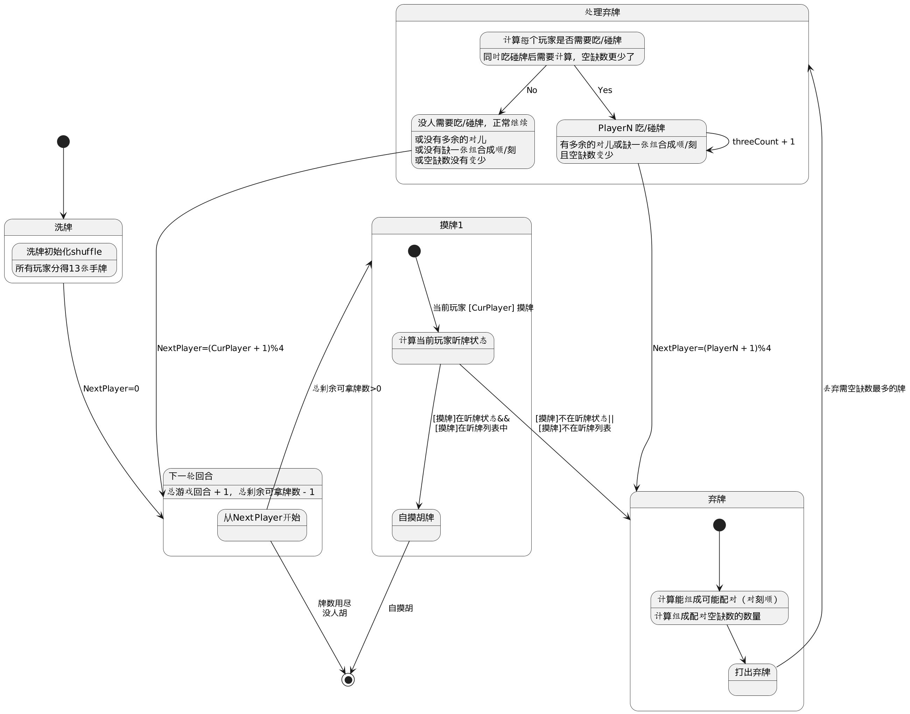

### 麻将四人玩家绘制流程

```Kotlin
fun 总流程() {
	洗牌初始化shuffle
	val 游戏轮数 = 总剩余牌数 = 136张牌 - 13张 * 4Player
	While (总剩余牌数>0) {
		一轮游戏(游戏轮数 - 1， 总剩余牌数 - 1)
	}
}
牌用尽，没有人胡 return false

fun 一轮游戏(游戏轮数， 总剩余牌数) {
	if (总剩余牌数 <= 0) {
		游戏结束，没人赢
		return false
	}
	计算当前Player的输赢生成听牌列表
	// 摸牌：
	总剩余牌数 -= 1
	判断是否自摸胡
	if (在听牌状态 && 摸牌在听牌列表) -> 胡了 
		return true
	else -> 弃牌

	// 弃牌：丢弃配对可能（对刻顺）最少的牌
	判断任意一家要吃/碰牌：
	if (该名玩家的牌能组成新的对刻顺 && threeCount > 0)
		// 吃牌/碰牌成功
		threeCount+1
		// 总剩余牌数不减少（因为只是弃牌和手牌的互换）		
		if (判断是否胡了) return true
		else 跳到该名吃牌/碰牌玩家的下一家，进行下一轮游戏
	else 不跳过任何玩家，正常进行下一轮游戏
}
```

## 决定弃牌

```Kotlin
摸牌+弃牌阶段是最复杂的，因为要打出当前最不可能赢的牌。
一副牌由：
1、顺和刻的个数2、对儿3、差一张的牌（A*C，AB/BC）
2、如果假设N=手上还需要替换掉才能赢的牌数目
   那么N最大的手牌需要被弃牌，表示需要替换掉的牌越多
   N = 2 * (4 - threesCount) + 差一张的牌 + abs(doubleCount - 1)
3、摸牌后有14张手牌，对每个手牌都需要计算N，然后丢弃N最大的牌：
fun getCardToDiscard(inputArray) {
	for (eachCard in inputArray) {
		val card13List = inputArray - eachCard
		howManyCardNeededToWin(card13List, depth = 0, threeCount = 0, missingOneCount = 0, doubleCount = 0, resultNeededCount = 13)
	}
}

4、计算N的思路：
fun howManyCardNeededToWin(remainArray,  depth, threeCount, missingOneCount, doubleCount, resultNeededCount) : Int {
	if (depth >= remainArray.size) {
		resultNeededCount = min(resultNeededCount, 2* (4 - threeCount) - missingOneCount + abs(doubleCount - 1))
		return resultNeededCount
	}
	var minResult = resultNeededCount	
	if (拿顺/刻) {
		val res = howManyCardNeededToWin(card13List, depth = depth, threeCount = threeCount + 1, missingOneCount = missingOneCount, doubleCount = doubleCount, resultNeededCount = resultNeededCount)
		minResult = min(res, minResult)
	}
	if (拿对儿) {
		val res = howManyCardNeededToWin(card13List, depth = depth, threeCount = threeCount, missingOneCount = missingOneCount, doubleCount = doubleCount + 1, resultNeededCount = resultNeededCount)
		minResult = min(res, minResult)
	}
	if (拿差一张的情况) {
		val res = howManyCardNeededToWin(card13List, depth = depth, threeCount = threeCount, missingOneCount = missingOneCount + 1, doubleCount = doubleCount, resultNeededCount = resultNeededCount)		minResult = min(res, minResult)
	}	
	val res = howManyCardNeededToWin(card13List, depth = depth + 1, threeCount = threeCount, missingOneCount = missingOneCount + 1, doubleCount = doubleCount, resultNeededCount = resultNeededCount)
	minResult = min(res, minResult)
	return minResult
}
```

