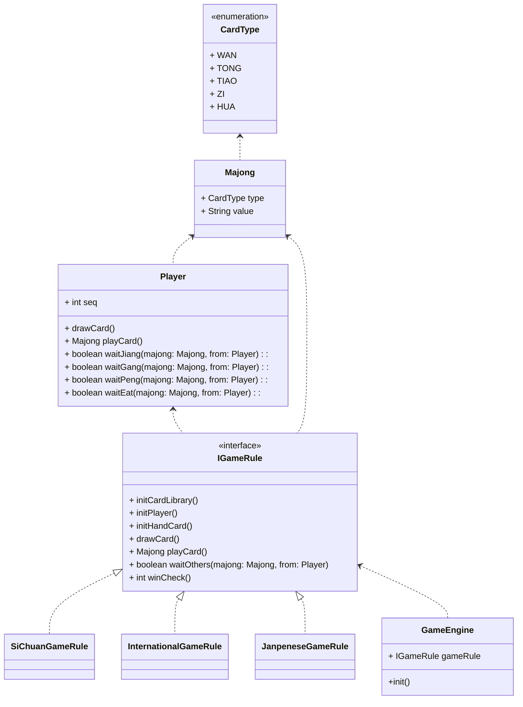

# 麻将游戏设计方案

## 需求分析

- 麻将牌的定义：万筒条(1~9)，字牌（东南西北中白发），花牌（春夏秋冬梅兰竹菊）
- 支持不同的游戏规则
  - 使用牌不同
  - 手牌不同
  - 积分规则不同
  - ...

## 游戏流程图

``` flow
st=>start: Start
e=>end
init=>operation: 游戏初始化
draw=>operation: 摸牌
winCheck=>condition: 是否胜利
play=>operation: 打牌
waitJiang=>condition: 吊将
waitGang=>condition: 杠
waitPeng=>condition: 碰
waitEat=>condition: 吃
st->init->draw->winCheck
winCheck(yes)->e
winCheck(no)->play->waitJiang
waitJiang(yes)->winCheck
waitJiang(no)->waitGang
waitGang(yes)->draw
waitGang(no)->waitPeng
waitPeng(yes)->winCheck
waitPeng(no)->waitEat
waitEat(yes)->winCheck
waitEat(no)->draw
```

## 类图设计



## 伪代码实现

```kotlin
class GameEngine {
  val gameRule: IGameRule
  fun init() {
    //
    gameRule.initCardLibrary()
    gameRule.initPlayer()
    gameRule.initHandCard()
    gameRule.drawCard()
    while(gameRule.winCheck() == 0) {
      val player = gameRule.currentPlayer()
      val playCard = gameRule.playCard()
      //其他玩家可以进行操作
      if (gameRule.waitOthers(playCard, currentPlayer)) {
        gameRule.playCard()
      }
    }
  }
}
```
